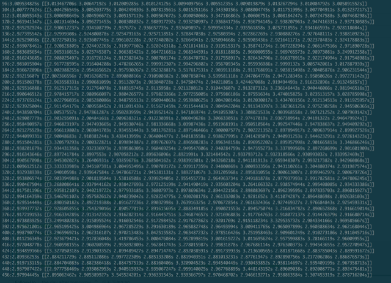

# 多模式匹配

* 多模式匹配（替换）具有很强的现实意义与实用价值：敏感词过滤，病毒特征码搜索等。
* 字典中约有一千条关键字，分为三大类：电影、音乐、电影&音乐，将输入文本中的字典记录替换为相应的类别文本。遵循贪婪原则与最长匹配原则。


## 原题

### 1. 目的

* 庆新年找点乐子。
* 切磋一下高性能编程。

### 2. 比赛时间

提交程序请在这个时间：2018-01–02  ～  2018-01-03 

### 3. 比赛奖励

* 总排名第一名 ，语言不限， 奖品 Kindle Oasis，价值2400+。 为了减弱C/C++的天然优势，把C/C++的时间x2计算。
* 主流编程语言内的第一名（Go，Java，OC，C/C++，Python，Shell，PHP，SQL），奖品罗技（Logitech）G502 炫光自适应游戏鼠标， 价值400+


### 4. 题目：基于词典的字符串替换。

#### 输入数据

一个词典文件dict.txt：内容如下所示。

```
让我爱你	-*音乐*-
超人奥特曼	-*电影*-
圣战奇兵	-*电影*-
火线勇气	-*电影*-
龙在江湖	-*电影*-
一个人	-*音乐*-
听海	-*音乐*-
双面特工	-*电影*-
花开自在	-*音乐*-
穿牛仔裤的十字军	-*电影*-
蜻蜓	-*电影*-
X档案	-*电影*-
金钱帝国	-*电影*-
```

此文件每一行分两个字段。用跳格分开。第一列为`key string`；第二列为`value string`。这个文件有1000+行。

一个输入文件`video_title.txt`，此文件1000万行。 请对这个文件中的每一行做如下加工：

#### 功能

将所有命中key string的字符串替换成value string。例如

`从前，东北一家人生活在伤心太平洋。` 替换完成后变成 `从前，-*电影*-生活在-*音乐&电影*-。`

替换后的结果请输出到result.txt文件。

#### 匹配原则

为了加强结果的稳定性，规定一些原则：

1. 从前向后匹配。例如如果`寂寞的季节`， `节日`都是 key string， 一条输入`寂寞的季节日日悲催`只会匹配到`寂寞的季节`， 不会再匹配`节日`
2. 贪心匹配原则，匹配最长的那个key string。例如`独立`，`独立日` 都是key string的话。一条输入`听说独立日这部电影是美国人拍的`，只会匹配上`独立日`，不会匹配到`独立`。如果没有比`独立日`更长的匹配的话。

#### 其他要求

1. 必须提交源代码。
2. 比的是算法与编程细节。必须单机运算，禁止分布式，禁止多核并发。
3. 可以对词典文件进行预处理，不允许对video_title文件预处理。
4. 不允许把结果文件存下来直接输出。
5. 内存占用必须小于500M。
6. 发现抄袭两人成绩同时作废。
7. 除了语言自带的标准库之外，禁止引入其他三方标准库。
8. 业余时间完成，不允许耽误工作。


## 比赛结果

* 结果文件MD5：5d76461b53079d20c08eb0b33c46b7cd


## 第一名感想总结

* 过早优化是万恶之源
  * 先保证正确性，在正确性的前提下渐进式优化。
* 以Profiling为依据，以Benchmark为准绳
  * 先优化算法，再做场景特定优化，然后优化IO，最后优化细节。

  ​


## 选型

### 语言

运算密集型应用，不考虑Python，Javascript，SQL，Shell等脚本语言。

Go的性能损失绝对不到C的一倍，因此一定选Go。但如果比绝对时长，那么选C。

### 算法

直觉：状态机，Trie，KMP

搜索发现：AC自动机，是融合了KMP思想的Trie树。

进一步了解：使用数组代替指针的进阶实现：Double Array Trie


## 分治

将问题划分为几个子问题：

* 生成ACDAT
  * 构建一颗Trie数
  * 构建Fail状态数组与Info状态数组
  * Info数组要保留该状态对应的重要信息：激发的关键词长度，激发的关键词类型。
* 使用ACDAT逐行处理
  * 先找出所有匹配：《开始位置，结束位置，关键词长度，关键词类型》
  * 根据匹配进行字符串替换
* IO使用Bufio，以行处理的方式进行。

```go
BuildDict()
for err = nil; err != io.EOF; line, err = reader.ReadSlice('\n') {
    writer.Write(HandleLine(line))
}
```


## 优化

算法层面的优化不细说了，大家用的基本上都是一样的方法。主要谈一谈工程上的优化。

工程上的一些技巧，从本机5秒优化至2.6秒

### 处理粒度: 1s

粒度是输入的字符宽度，对实现有决定性的影响。

本题中可以使用三种粒度：字节(byte)，双字节(int16)，四字节(int)。

本例中文本均为UTF8编码，UTF8为变长编码。

* 使用`int32`，即`rune`为单位
  * 最为通用的做法，可以处理所有Unicode字符，包括Emoji等。（在本题中并没有）
  * 需要较少的状态转移判断。
  * 状态数组长度约10W。比较宽，总大小在1.6M左右。
* 使用int16，即双字节编码
  * 可选UTF16，GBK等编码，但这是开历史倒车的行为。
  * 需要对输入文件做转码，违背题目约束，如果运行时转码总用时不见得会更快。
  * 如果输入已经转码，处理会很快，尤其对于Java，C#这类语言。
* 使用int8，按照字节处理
  * 可以处理二进制数据
  * **可以避免[]Byte、String、[]Rune相互转化的开销。**
  * 状态数组非常更小，缓存友好。
  * 无效判断大大增多，状态转移判断数翻倍（2KW 到 4KW）。

最终选择了 `int32`的做法，这是最有通用性，也是实际bench中性能最好的方案。


### 字符串、字符数组、字节数组转换： 0.5s

* [深入Go文本类型](https://vonng.com/blog/go-text-types/)，[]byte转为string是相对安全的操作，因为string相比[]byte只是少了一个cap字段。

```go
for _, c := range *(*string)(unsafe.Pointer(&input))
```

### 编码与解码： 0.3s

使用自定义的Rune解码函数代替标准库的WriteRune，有0.3s的性能提升。

```go
func WriteRune(r rune) {
	switch i := uint32(r); {
	case i <= 127:
		Buf[BSP] = byte(r)
		BSP++
	case i <= 2047:
		Buf[BSP] = 0xC0 | byte(r>>6)
		BSP++
		Buf[BSP] = 0x80 | byte(r)&0x3F
		BSP++
	case i <= 65535:
		Buf[BSP] = 0xE0 | byte(r>>12)
		BSP++
		Buf[BSP] = 0x80 | byte(r>>6)&0x3F
		BSP++
		Buf[BSP] = 0x80 | byte(r)&0x3F
		BSP++
	default:
		Buf[BSP] = 0xF0 | byte(r>>18)
		BSP++
		Buf[BSP] = 0x80 | byte(r>>12)&0x3F
		BSP++
		Buf[BSP] = 0x80 | byte(r>>6)&0x3F
		BSP++
		Buf[BSP] = 0x80 | byte(r)&0x3F
		BSP++
	}
}
```

### 缓冲区大小

操作系统一个Page大小为4k，但宝存的SSD，一次写入都是32K。所以在普通闪存盘上32k的缓冲区表现的很不错了。不过后来换成了Ramdisk，事情就不一样了。



所以IO的Buffer设置为128k，表现还不错。

我也试过用系统调用一次性读完，一次性写入，有一定提升，但内存消耗就变成O(n)的了。所以就没用。

出乎意料的是，使用ramdisk并没有对整体性能产生质的提升。一个原因是IO的pattern是顺序读取与顺序写入。对于PCI-E Nvme SSD而言，内存盘并没有绝对性的优势。


### 条件分支重排： 0.3s

通过检查分支命中的概率，重排、组合条件分支，能有0.3秒的性能提升。


### 全局变量 vs 本地变量: 0.1

使用全局变量带来了0.1s的优化


### 字典常量 vs 动态创建 0.15s 

存在只读段的数组，访问起来竟然比本地读取重新构建还要慢，不禁陷入深思


## 说明

```bash
# create ramdisk and prepare data
$ make setup

# run check & benchmark
$ make
time ./ac
time: 2.436752325s sig: 5d76461b53079d20c08eb0b33c46b7cd
Round 0: 2.421192005s
Round 1: 2.495772601s
Round 2: 2.787171783s
Round 3: 2.694790848s
Round 4: 2.680434589s
Round 5: 2.596039786s
Round 6: 2.604909265s
Round 7: 2.674714527s
Round 8: 2.757678107s
Round 9: 2.611880906s
Avg: 2.639527578s
       29.39 real        27.55 user         1.62 sys
```

